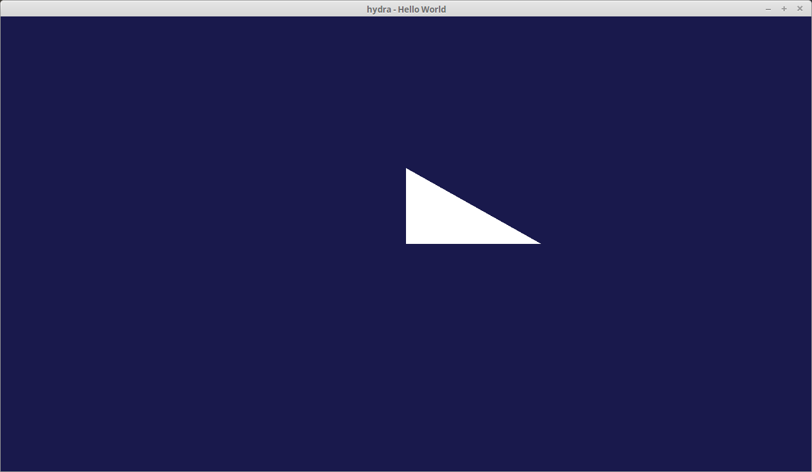
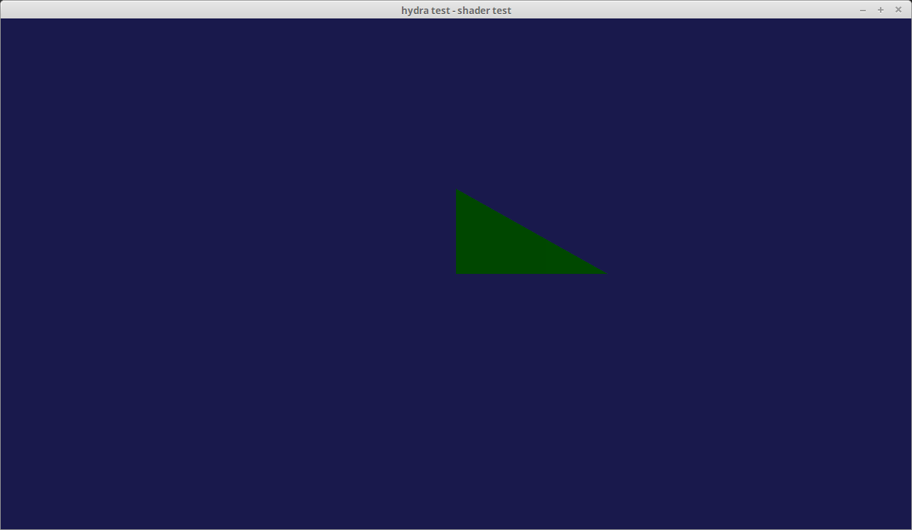
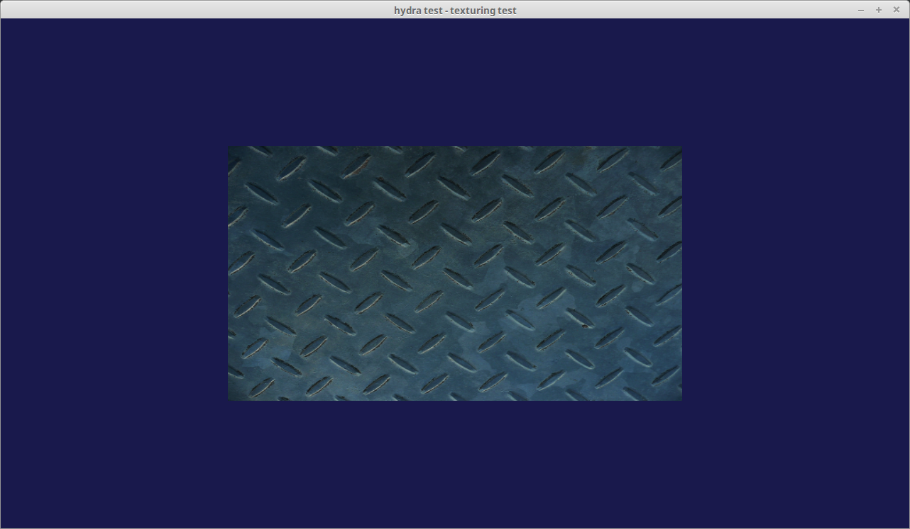
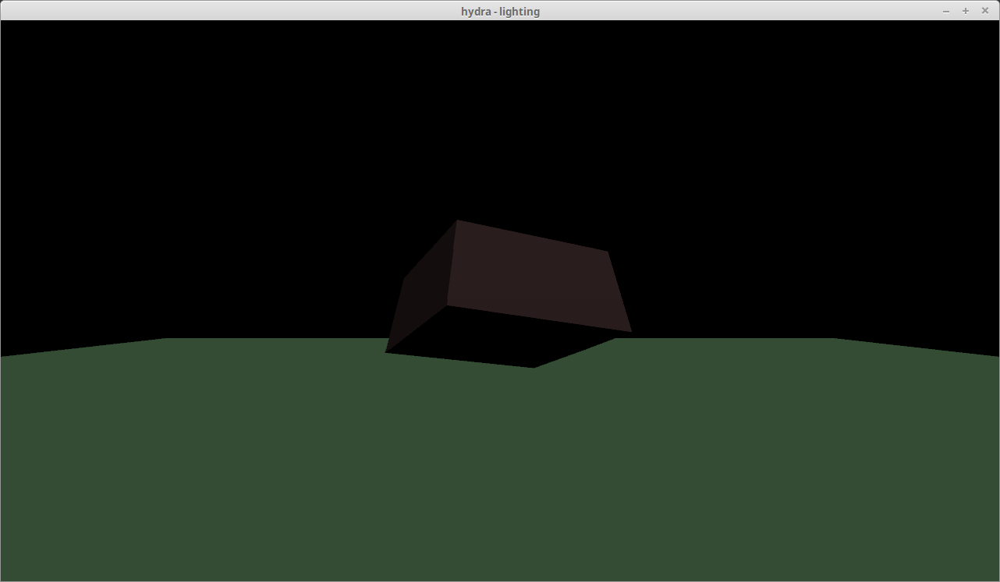
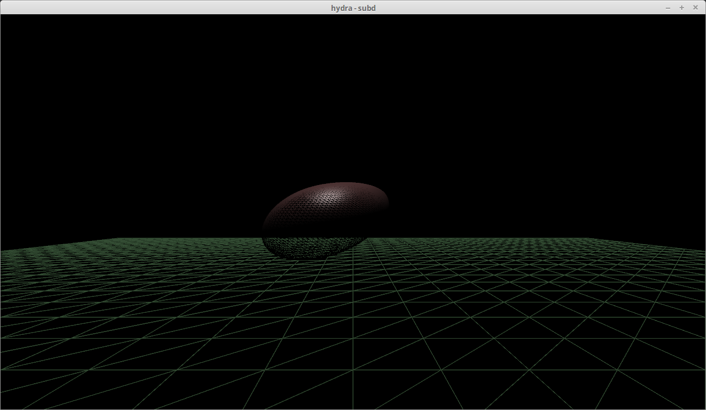
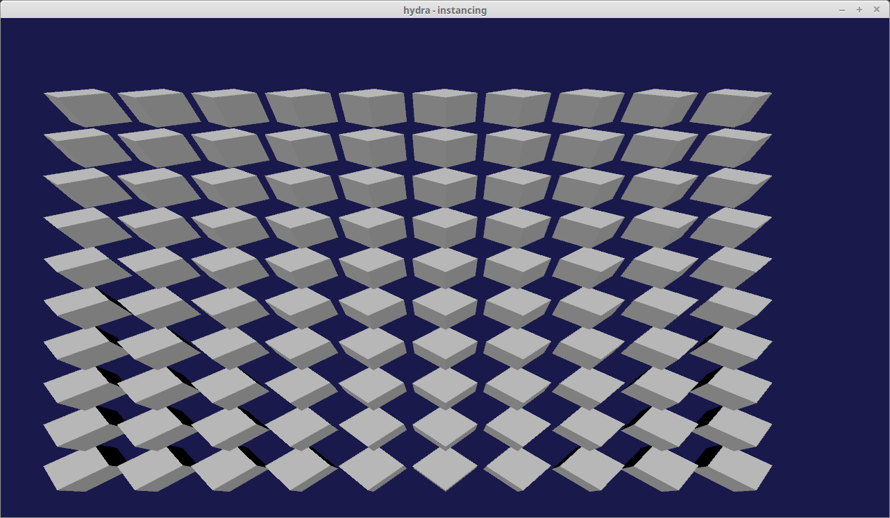
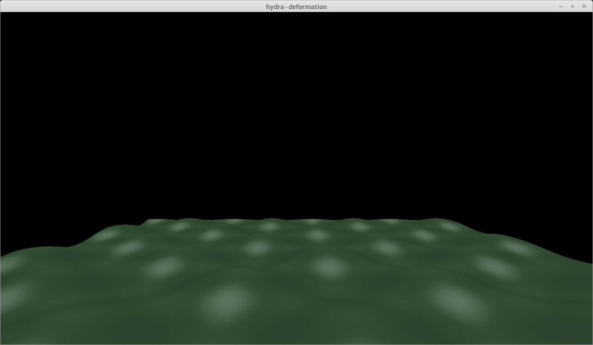
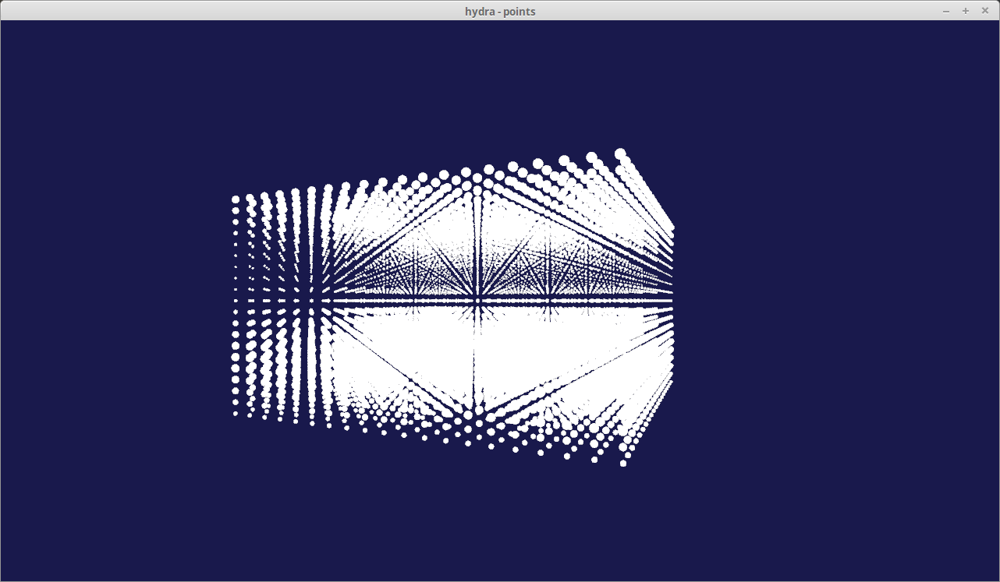
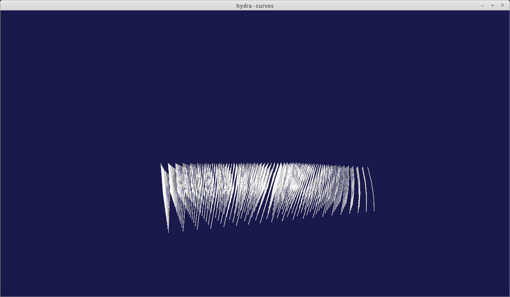

# Hydra Tests

A bunch of examples to learn the Hydra C++ API. 

## Build Instructions

Using the USD build script **build_usd.py** should also build the following examples to *{USD_INSTALL_DIR}/hydra-examples/bin*

## Examples

### Hello World

The graphics equivalent of the 'Hello World' application, a window with a single triangle. 

### Simple Object

Display a teapot .obj file. 

### Shader

Constant shader on a cube with animated color parameter.

### Texturing

Texture displayed on a Quad.

### Lighting

Spinning lit cube.

### SubD

Subdivided plane & vertex animated cube.

### Instancing

Instance an array of cubes.

### Deformation

Plane with simple animated deformation.

### Points

Lattice of points where the width primvar is animated.

### Curves

Array of curves with simple animation.

## To Do

* shadows
* displacement
* volume ray marching
* Render Targets & post processing

